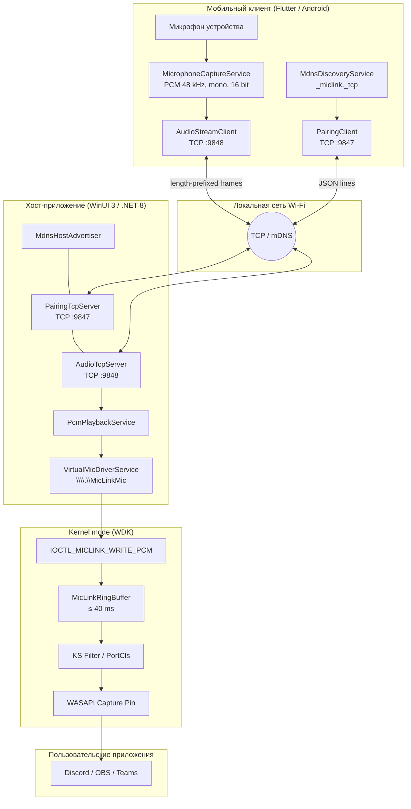
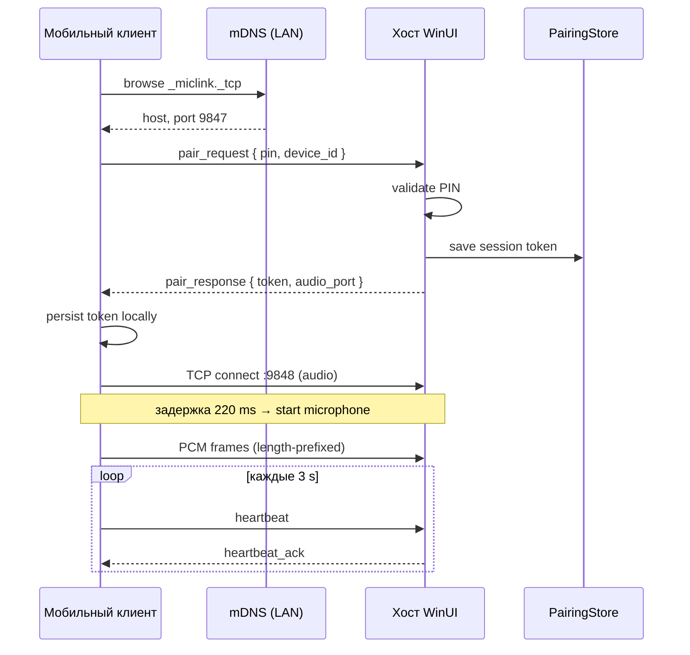
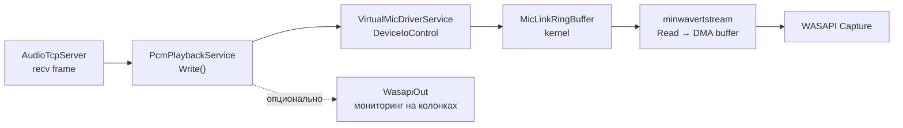
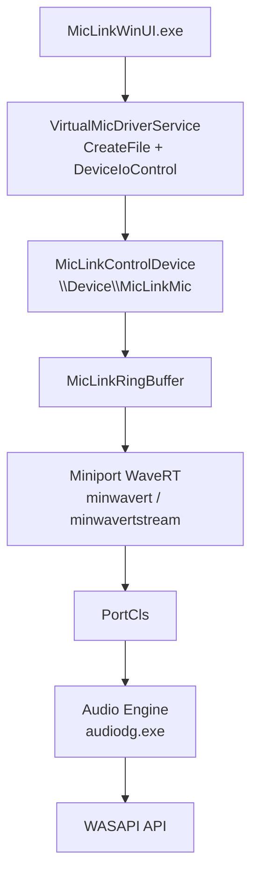
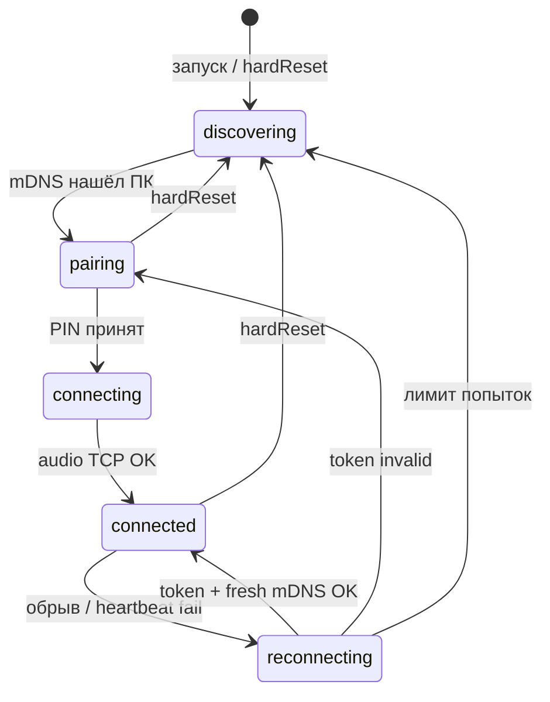

# MicLink

**Система беспроводной передачи аудиосигнала с мобильного устройства на персональный компьютер с регистрацией в качестве виртуального микрофона операционной системы.**

---

## Аннотация

MicLink реализует архитектуру «клиент–хост» для передачи потока PCM-аудио по локальной сети Wi‑Fi. Мобильное приложение (Android, Flutter) захватывает сигнал с встроенного микрофона, кодирует его в несжатый формат и передаёт на хост-приложение (Windows, WinUI 3). Хост записывает принятые сэмплы в kernel-mode драйвер виртуального аудиоустройства, который экспонирует стандартный capture-пин через подсистему WASAPI. В результате любое пользовательское ПО (Discord, OBS, Teams и т.д.) воспринимает телефон как обычный микрофон Windows без промежуточных виртуальных кабелей (VB-Cable и аналоги).

Система спроектирована с разделением **канала управления** (pairing, heartbeat, mute) и **канала данных** (аудиопоток), что снижает взаимное влияние сетевых задержек на управляющую логику и упрощает масштабирование протокола.

---

## 1. Постановка задачи

| Требование | Реализация |
|------------|------------|
| Минимальная задержка end-to-end | Прямая запись в драйвер, TCP `NoDelay`, кольцевой буфер ≤ 40 ms |
| Прозрачность для приложений | Виртуальное устройство через PortCls / KS filter → WASAPI Capture |
| Простое сопряжение в LAN | mDNS-обнаружение + одноразовый PIN |
| Повторное подключение без PIN | Сохранённый session token + актуальный IP из mDNS |
| Отсутствие сторонних аудиодрайверов | Собственный WDK-драйвер на базе Virtual-Audio-Driver (MIT) |

---

## 2. Общая архитектура



**Рис. 1.** Логическая топология системы: два независимых TCP-канала, единый аудиоконвейер от микрофона телефона до WASAPI.

---

## 3. Компоненты и технологический стек

| Слой | Технология | Назначение |
|------|------------|------------|
| Мобильный UI | Flutter (Dart) | Захват, сопряжение, индикация состояния |
| Хост UI | WinUI 3, .NET 8 | Управление сессией, мониторинг уровня, установка драйвера |
| Транспорт | TCP/IP, mDNS (`_miclink._tcp`) | Обнаружение и двухканальная передача |
| Аудиоформат | PCM, 48 000 Hz, 1 канал, 16 bit LE | Сквозной формат без перекодирования |
| Виртуальное устройство | WDK, PortCls, KS filter | Регистрация capture-устройства в Windows |
| Мониторинг (опц.) | NAudio WasapiOut | Воспроизведение копии потока на динамики ПК |

### 3.1. Структура репозитория

```
Microfon Application/
├── Mobile/miclink/              # Flutter-приложение (Android)
├── Pc/MicLinkWinUI/             # WinUI 3 хост-приложение
├── drivers/MicLinkVirtualAudio/ # WDK-драйвер + скрипты сборки/подписи
├── Pc/scripts/                  # Публикация, установка, релиз
├── Pc/installer/                # Inno Setup (MicLinkSetup.iss)
├── TESTING.md                   # Пошаговое тестирование
└── README.md                    # Настоящий документ
```

---

## 4. Протокол управления (Control Plane)

Канал управления работает поверх **TCP-порта 9847**. Сообщения — однострочный JSON (newline-delimited). Версия протокола: **v1**.

### 4.1. Типы сообщений

| Тип | Направление | Назначение |
|-----|-------------|------------|
| `pair_request` | Phone → PC | Запрос сопряжения с PIN и device_id |
| `pair_response` | PC → Phone | Токен сессии, порты, имя ПК |
| `reconnect_request` | Phone → PC | Восстановление сессии по токену |
| `reconnect_response` | PC → Phone | Подтверждение или отказ |
| `heartbeat` / `heartbeat_ack` | Phone ↔ PC | Контроль живости (интервал 3 s) |
| `mute_update` | Phone → PC | Сигнал отключения захвата |

### 4.2. Обнаружение в сети

ПК публикует mDNS-сервис типа `_miclink._tcp` с именем машины. Телефон периодически выполняет discovery (интервал 4 s) и **не использует закэшированный IP** при переподключении — адрес всегда обновляется из свежего mDNS-ответа, что устраняет сбои при смене DHCP-адреса хоста.

### 4.3. Диаграмма сопряжения



**Рис. 2.** Процедура первичного сопряжения и установки аудиоканала.

---

## 5. Протокол передачи аудио (Data Plane)

Аудиоданные передаются по **отдельному TCP-соединению (порт 9848)**, что изолирует поток высокой пропускной способности от управляющих сообщений.

### 5.1. Формат кадра

```
┌────────────────┬──────────────────────────────┐
│ length (4 B)   │ payload (length байт)        │
│ uint32 LE      │ raw PCM int16, mono, 48 kHz  │
└────────────────┴──────────────────────────────┘
```

Параметры потока (общие для всех звеньев конвейера):

| Параметр | Значение |
|----------|----------|
| Частота дискретизации | 48 000 Hz |
| Разрядность | 16 bit, signed, little-endian |
| Каналы | 1 (mono) |
| Битрейт | 768 kbps |
| Обработка на телефоне | AGC, echo cancellation, noise suppression — **отключены** |

На сокете включён **TCP_NODELAY** (и на клиенте, и на сервере) для снижения задержки алгоритма Nagle.

### 5.2. Конвейер обработки на хосте



**Рис. 3.** Путь PCM-сэмпла от сетевого сокета до пользовательского приложения.

---

## 6. Подсистема виртуального микрофона (Kernel)

Драйвер основан на форке [Virtual-Audio-Driver](https://github.com/VirtualDrivers/Virtual-Audio-Driver) (лицензия MIT) с добавлением канала пользовательской подачи PCM.

### 6.1. Интерфейс IOCTL

Пользовательский процесс открывает устройство `\\.\MicLinkMic` и записывает сырые PCM-блоки:

```
IOCTL_MICLINK_WRITE_PCM
  Device type : 0x8000
  Method      : METHOD_BUFFERED
  Access      : FILE_WRITE_DATA
```

Константы формата определены в `drivers/MicLinkVirtualAudio/include/miclink_ioctl.h` и синхронизированы между kernel- и user-mode кодом.

### 6.2. Кольцевой буфер и ограничение задержки

В режиме ядра действует **кольцевой буфер** (`MicLinkRingBuffer`) с верхней границей накопления:

$$\text{max\_bytes} = f_s \times b_{frame} \times T_{max}, \quad T_{max} = 40\ \text{ms}$$

При переполнении старые сэмплы отбрасываются (trim-on-write), что предотвращает накопление сетевого джиттера в capture-пине. Capture-поток читает буфер напрямую в DMA-буфер **без промежуточного преобразования формата** — устройство декларирует mono 16-bit 48 kHz, совпадающий с входным потоком.

### 6.3. Стек драйвера в Windows



**Рис. 4.** Уровни абстракции от user-mode feeder до API захвата звука.

В списке устройств Windows микрофон отображается как **«MicLink Microphone»** / **«Микрофон (MicLink Virtual Audio)»** (зависит от локали).

---

## 7. Машина состояний соединения

### 7.1. Состояния мобильного клиента



**Рис. 5.** Диаграмма состояний `ConnectionRepository` (мобильный клиент).

Ключевые инварианты:

- **`hardReset()`** — полный сброс: таймеры, сокеты, аудио, сохранённая сессия; эквивалент «чистой установки» без переустановки APK.
- Переподключение использует **сохранённый token + актуальный host из mDNS**, никогда — только IP из SharedPreferences.
- Перед стартом захвата выполняется **`_beginLiveAudio`**: stop → connect TCP → пауза 220 ms → start mic (устраняет рассинхронизацию буферов при mute/unmute и reconnect).

### 7.2. Состояния хоста

| Состояние | PIN на экране | Аудиосервер |
|-----------|---------------|-------------|
| Disconnected / Discovering | Да | Слушает :9848 |
| Connected | Нет | Принимает поток |
| После обрыва Connected-клиента | PIN регенерируется | Продолжает слушать |

При замене TCP-клиента на порту 9847 событие `ClientDisconnected` генерируется **только если** отключился текущий активный клиент — это предотвращает ложную смену PIN при переподключении.

---

## 8. Буферизация и оценка задержки

| Участок | Механизм | Порядок величины |
|---------|----------|------------------|
| Захват на Android | record stream chunks | ~20–40 ms |
| TCP (LAN) | length-prefixed frames, NoDelay | 1–5 ms |
| Kernel ring buffer | trim at 40 ms | ≤ 40 ms |
| WASAPI capture buffer | системный буфер Windows | 10–30 ms |

Суммарная end-to-end задержка в типичной домашней Wi‑Fi сети составляет **порядка 80–120 ms**, что приемлемо для голосовой связи. Ранние версии с дополнительным user-mode jitter buffer (~120 ms) и несовпадением форматов (mono→stereo float) давали слышимые артефакты («chipmunk») и были устранены переходом на сквозной mono PCM passthrough.

---

## 9. Сборка и развёртывание

### 9.1. Быстрый старт (разработка)

Подробная инструкция: **[TESTING.md](TESTING.md)**.

```text
1. PC:  Visual Studio → F5  (Pc/MicLinkWinUI/MicLinkWinUI.sln, Debug x64)
2. Phone: cd Mobile/miclink && flutter run
3. Ввести PIN с экрана ПК → проверить уровень на вкладке Microphone
4. Discord → устройство ввода → «MicLink Microphone»
```

### 9.2. Драйвер (однократно на машине разработчика)

```bat
drivers\scripts\build-miclink-driver.bat
```

Подпись (test signing, PowerShell от администратора):

```powershell
bcdedit /set testsigning on
drivers\scripts\sign-driver-package.ps1
```

Установка устройства: `Assets/Scripts/install-driver.ps1` (bundled в приложении) или `devgen` + `pnputil`.

### 9.3. Релиз

| Платформа | Команда / документ |
|-----------|-------------------|
| Windows portable | [Pc/scripts/publish-portable.ps1](Pc/scripts/publish-portable.ps1) |
| Windows installer | [Pc/installer/MicLinkSetup.iss](Pc/installer/MicLinkSetup.iss) (Inno Setup) |
| Android APK | `cd Mobile/miclink && flutter build apk --release` |
| Установка | [Pc/scripts/INSTALL.md](Pc/scripts/INSTALL.md) |

### 9.4. Подпись драйвера для production

Для работы **без Test Mode** (`bcdedit testsigning`) требуется attestation signing через Microsoft Hardware Dev Center (EV-сертификат или Azure Trusted Signing). В режиме разработки достаточно test signing — водяной знак «Test Mode» на рабочем столе, перезагрузка BIOS не требуется.

---

## 10. Безопасность

- Сопряжение ограничено **локальной сетью**; PIN действует как одноразовый shared secret на LAN.
- Session token хранится локально на телефоне (SharedPreferences) и на ПК (PairingStore); при компрометации token сбрасывается через `hardReset` или перезапуск с новым PIN.
- Аудиоканал не шифруется — проектирование ориентировано на доверенную домашнюю сеть; для публичных Wi‑Fi рекомендуется VPN или доработка TLS.

---

## 11. Связанная документация

| Документ | Содержание |
|----------|------------|
| [TESTING.md](TESTING.md) | Пошаговое тестирование, troubleshooting |
| [Pc/scripts/INSTALL.md](Pc/scripts/INSTALL.md) | Установка на конечную машину |
| [Pc/scripts/RELEASE.md](Pc/scripts/RELEASE.md) | Публикация релиза |

---

## 12. Лицензии

- Драйвер виртуального аудио: форк [Virtual-Audio-Driver](https://github.com/VirtualDrivers/Virtual-Audio-Driver), лицензия **MIT**.
- Остальной код проекта — см. файлы лицензий в соответствующих каталогах.

---

## Сокращения

| Сокращение | Расшифровка |
|------------|-------------|
| PCM | Pulse-Code Modulation |
| WASAPI | Windows Audio Session API |
| WDK | Windows Driver Kit |
| KS | Kernel Streaming |
| mDNS | Multicast DNS (DNS-SD) |
| IOCTL | I/O Control Code |
| LAN | Local Area Network |
